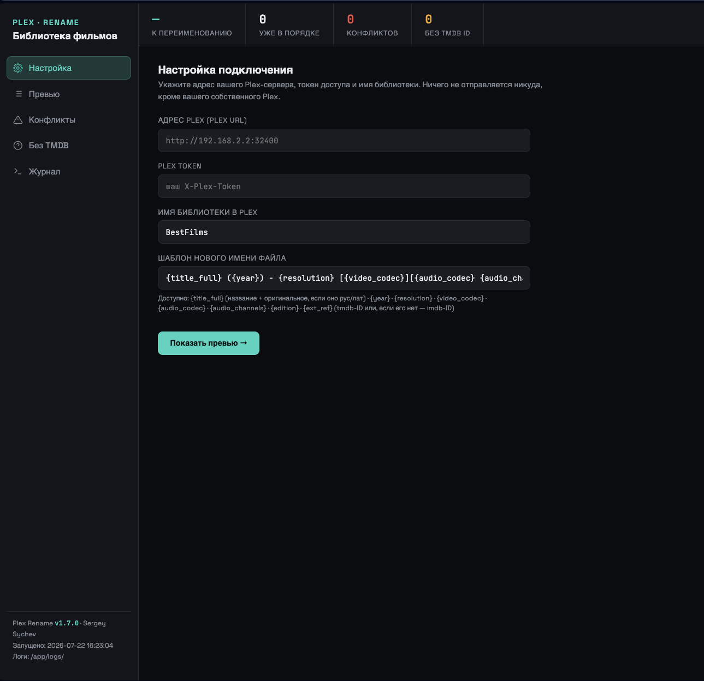
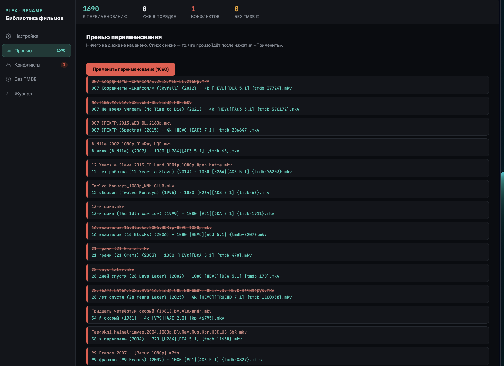
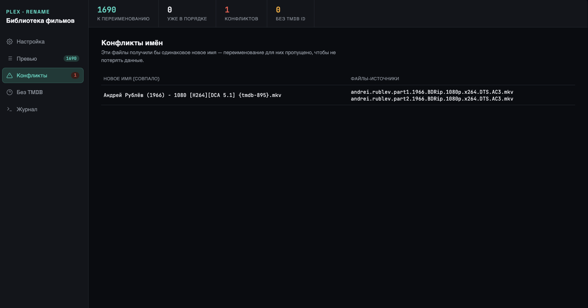

# Plex Rename

Веб-приложение переименовывает файлы фильмов, используя данные из вашего Plex: название на двух языках, год, качество, кодеки, каналы звука, издание, уникальный ID (TMDB, IMDb или Кинопоиск — что есть у фильма). Запускается у вас на сервере, открывается в браузере, обращается только к вашему собственному Plex.

**Автор:** Sergey Sychev

---

## Скриншоты

| Настройка | Превью переименования | Диагностика |
|---|---|---|
|  |  |  |

---

## Зачем это нужно

Коллекция, собранная за годы из разных источников, обрастает случайными именами файлов: то оригинальное название, то русское, то транслит, то имя релизера вместо названия фильма. Plex Rename не гадает по имени файла заново. Он берёт то, что Plex уже сопоставил, и переименовывает файл под единый формат.

## Возможности

- Веб-форма, терминал после установки не нужен.
- Полное превью (было → станет) до любых изменений на диске.
- Два файла с одинаковым новым именем не переименовываются — оба уходят в список конфликтов.
- Фильмы, которых Plex не опознал, тоже не трогает — показывает их отдельно.
- Берёт ID из TMDB, IMDb или Кинопоиска — смотря что есть у фильма в Plex.
- Повторный запуск трогает только новые или изменившиеся файлы. Уже переименованные пропускает.
- Журнал переименования сохраняется в файл на диске.
- Прогресс-бар и индикатор загрузки на долгих операциях.
- Диагностика: можно посмотреть сырые данные, которые Plex отдаёт по конкретному фильму.

## Установка

Нужен Docker: Container Manager на Synology, Portainer, или обычный `docker compose`.

1. Скачайте `app.py` и `docker-compose.yaml` в отдельную папку, например `plex-rename-app/`.
2. Откройте `docker-compose.yaml`, поправьте путь к папке с фильмами в разделе `volumes`: слева путь на вашем сервере, справа — тот же путь, каким его видит Plex. Проще всего сделать их одинаковыми.
3. Запустите:
   ```
   docker compose up -d
   ```
   Или через Container Manager: Проект → Создать → указать папку → Запустить.
4. Откройте `http://<адрес-сервера>:5055`.

### Про `network_mode: host`

Контейнер использует сетевой режим хоста, чтобы достучаться до Plex по локальному IP вашей сети. Обычный docker-мост не может обратиться к собственному LAN-адресу хоста — частая проблема на Synology и QNAP. Режим работает на Linux-хостах.

Если ваш Docker не поддерживает host-режим (Docker Desktop на Windows или Mac) — уберите `network_mode: host`, раскомментируйте блок `ports`, и укажите в приложении реальный LAN-адрес Plex вместо `localhost`.

## Использование

1. На вкладке «Настройка» впишите адрес Plex (`http://IP:32400`), токен и точное имя библиотеки. Токен смотрите в самом Plex: любой фильм → ⋯ → «Получить информацию» → «View XML» → в адресной строке `X-Plex-Token=...`.
2. Нажмите «Показать превью». На больших библиотеках появится индикатор загрузки — дождитесь его.
3. Проверьте вкладки «Конфликты» и «Без TMDB». Если фильм не находится, а должен — используйте диагностику на вкладке «Без TMDB»: впишите название, посмотрите сырые данные Plex по нему.
4. Список на вкладке «Превью» устраивает — нажимайте «Применить переименование».
5. Прогресс виден на вкладке «Журнал». Тот же журнал сохраняется файлом в `logs/`.

Инструмент можно перезапускать сколько угодно раз: уже переименованные файлы пропускаются, счётчик «уже в порядке» на верхней панели это показывает.

## Шаблон имени файла

| Плейсхолдер | Значение |
|---|---|
| `{title_full}` | Название + оригинальное в скобках, если оно на русском или латинице |
| `{year}` | Год выпуска |
| `{resolution}` | Разрешение: 1080, 4k и т.д. |
| `{video_codec}` | Видеокодек (HEVC, H264), плюс HDR или Dolby Vision, если Plex их определяет |
| `{audio_codec}` | Аудиокодек: AC3, DTS, TRUEHD |
| `{audio_channels}` | Каналы звука: 2.0, 5.1, 7.1 |
| `{edition}` | Издание (Director's Cut и т.п.), если указано в Plex |
| `{ext_ref}` | ID: `tmdb-12345`, `imdb-tt0078788` или `kp-354` — что нашлось |

По умолчанию:
```
{title_full} ({year}) - {resolution} [{video_codec}][{audio_codec} {audio_channels}]{edition} {ext_ref}
```

## Устранение неполадок

**«Bind mount failed»** при запуске контейнера. Файл `app.py` не лежит в одной папке с `docker-compose.yaml`, или назван иначе.

**«HTTPConnectionPool ... Connection refused / timed out»**. Контейнер не достучался до Plex. Проверьте `network_mode: host` и что адрес Plex указан с `http://` и правильным портом.

**«401 Unauthorized»**. Токен неверный или устарел. Получите заново и скопируйте без лишних символов.

**Фильм не находится, хотя есть в Plex**. Откройте диагностику на вкладке «Без TMDB», впишите название, посмотрите «Показать сырые данные». Если `movie.guid` содержит незнакомый формат — не `themoviedb`, не `imdb`, не `kinopoisk` — сохраните этот вывод, понадобится добавить поддержку ещё одного агента.

**Radarr не видит файлы после переименования**. Зайдите в Radarr, запустите «Обновить всё» — он перечитает новые пути.

## История версий

- **v1.7.2** — прогон кода через тесты: порядок DOM-элементов, граничные случаи функций, понятная ошибка при опечатке в шаблоне вместо сырого `KeyError`, полный сквозной прогон `/preview` и `/apply` с реальными файлами.
- **v1.7.1** — исправлен порядок элементов в HTML: индикатор загрузки ссылался на себя раньше, чем появлялся в разметке, поэтому не показывался.
- **v1.7.0** — индикатор загрузки на долгих операциях: превью, применение, диагностика.
- **v1.6.0** — поддержка Кинопоиска как источника ID, два формата ссылок сторонних агентов: `kinopoisk2://ID` и `.../movie/ID`.
- **v1.5.0** — поддержка IMDb ID, когда у фильма в Plex нет TMDB.
- **v1.4.0** — диагностика: просмотр сырых данных Plex (`guid`/`guids`) по конкретному фильму.
- **v1.3.0** — редизайн интерфейса: боковое меню с вкладками вместо длинной страницы, счётчики на верхней панели, версия и время запуска в подвале.
- **v1.2.0** — защита от коллизий имён; фильмы без ID пропускаются отдельным списком; оригинальное название фильтруется (только русский и латиница); журнал в файл на диске; прогресс-бар; поля HDR, каналы звука, издание.
- **v1.1.0** — исправлено определение аудиокодека: данные берутся напрямую из Plex API, а не через ручной разбор потоков.
- **v1.0.0** — первая версия: подключение к Plex, превью и применение переименования по базовому шаблону.

## Лицензия

Свободно для личного использования. При распространении сохраняйте указание автора.
